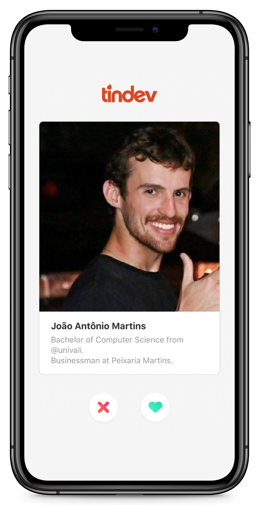

<h1 align="center">
    
</h1>

<h4 align="center">
  🚀 Semana OmniStack 8.0 by RocketSeat
</h4>

  
  

## 📱 Interfaces

O aplicativo mobile é composto por uma interface principal onde são carregado em um container as informações dos desenvolvedores cadastrado na aplicação. Com isso é possível dar um `Like` ou `Deslike` nos desenvolvedores.

    

## 🔄 Executar

- Entrar na pasta `mobile`;
- Executar `yarn install` para instalar dependências do projeto;
- Executar `yarn start` para que o projeto seja executado;

## 📝 Licença

Este projeto está sobre a licença MIT. Veja o arquivo [LICENSE](../LICENSE.md) para mais detalhes.

---

<h4 align="center">
  Feito com ❤️ by Gustavo Souza
</h4>
